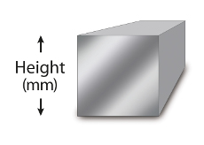

# BarsAndTubes

Simple 3D library for [openscad](http://www.openscad.org/) that makes it easy to generate the most common bar and tube profiles.


## Usage

Just include the file BarsAndTubes.scad in the beginning of your scad file like this: 

```include <BarsAndTubes.scad>;```

## Profiles

Up to now there are following basic metal profiles available:

**`Hexagonal Bar:`**   ```hexBar( barWidth,barLength );```


**`Rectangular Bar:`**  ```rectangularBar( barWidth,barHeight,barLength );```


**`Square Bar:`**  ```squareBar( barWidth,barLength );```




**`Round Bar:`**  ```roundBar( barDiameter,barLength );```


**`Rectangular Tube:`**  ```rectangularTube( tubeWidth, tubeHeight, tubeLength, tubeWall );```


**`Square Tube:`**  ```squareTube( tubeHeight, tubeLength, tubeWall );```


**`Round Tube:`**  ```roundTube( tubeDiameter, tubeLength, tubeWall );```


**`Angle Iron:`**  ```angleIron( angleWidth, angleHeight, angleLength, angleWall );```


**`U Profile:`**  ```uProfile( uprofileWidth, uprofileHeight, uprofileLength, uprofileWall );```


## References

* http://www.openscad.org/
* https://www.thingiverse.com/thing:2550584

## Authors:

* quirxi (https://github.com/quirxi)


## License

Distributed under the MIT License.


